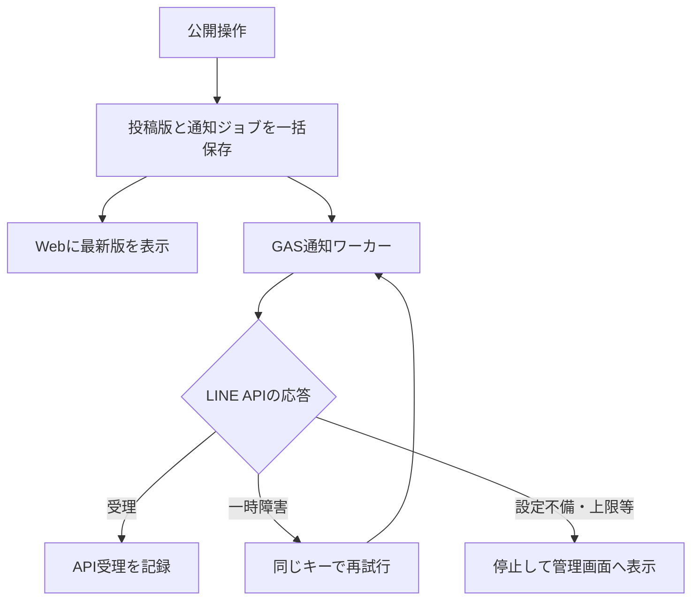
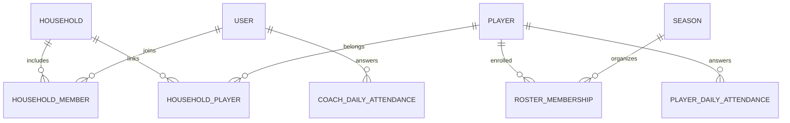

# 少年野球グループウェア 要件定義・基本設計

版：0.3 ／ 更新日：2026年10月9日 ／ ステータス：開発着手前の検討案

## 今回の変更（v0.3）

選手の出欠を予定から切り離し、独立ページで今日から2か月先まで日付ごとに登録する。全会員は選手の出欠をA・B・Cチーム別に閲覧できる。コーチロールを追加し、保護者との兼任を可能とする。コーチ本人が自分の出欠を登録し、コーチ同士だけでその一覧を閲覧する。

「全員」は同一団体の有効な会員を意味し、インターネットへの一般公開ではない。「2か月先」は日本時間の今日から2暦月後の同日までを両端を含めて扱う（同日が存在しない月は月末）。例えば10/9なら12/9まで。期間の定義は本版の実装判断とする。

デモは画面内の状態だけを保持する静的HTML。実際の認証・会員間の共有・サーバーの権限制御・永続保存は未実装。デモのロール切り替えは確認用で、本番に自己昇格機能を設けない。

## 1. このアプリで実現すること

**「今日、誰が、どこへ、何を持って行けばよいか」「何が変わったか」が、スマホを開けば分かるチーム運営基盤をつくる。**

正式な情報はWebに集約し、LINEは更新を知らせる入口にする。予定・お知らせ・試合はそれぞれ同じURLを使い続け、変更履歴を残す。連絡のたびに新しいグループや重複投稿を増やさない。

| 現在の問題 | 実現する仕組み | 改善を確認する観点 |
|---|---|---|
| LINEで情報が流れてしまう | 日付・分類・対象別の一覧と検索、資料の保管 | 過去の案内を検索して見つけられる |
| 変更後の正しい情報が分からない | 固定URL、最新版表示、変更点、更新日時、履歴 | 古い通知から開いても最新版にたどり着く |
| グループが増え続ける | Web内の学年・チーム・役割による対象指定 | 行事ごとのLINEグループ新設を減らせる |
| 連絡を確認したか分からない | 重要連絡の「確認しました」、家庭単位の未確認一覧 | 運営が確認の必要な家庭だけ把握できる |
| 試合経過が別の場所に散らばる | 予定から試合速報・確定結果にアクセス | 同じ試合ページで経過と結果を確認できる |

成功指標案：試行前後で「情報の所在を尋ねる問い合わせ」「最新版の取り違え」「稼働LINEグループ数」を記録する。重要連絡は確認期限までの家庭確認率を確認する。数値目標は試行開始時にチーム運営者が定める。

## 2. 確定している条件と設計上の仮定

### 2.1 ユーザー提示の条件

- 最初の成果物は要件定義・設計書。
- LINE中心の連絡をWebアプリに集約したい。
- Webのお知らせ公開に合わせて、LINEグループへ通知したい。
- Messaging APIの有料契約・追加課金は行わない。GASを中継に利用する。ただしGAS経由でもLINEの無料通数制限は適用される。
- 家庭ごとのアカウントと選手を紐づけたい。
- 選手の出欠は予定と独立して2か月先まで登録し、全会員がA・B・Cチーム別に閲覧する。
- コーチロールを設け、保護者との兼任を可能とする。コーチは自分の出欠を登録し、コーチ同士で閲覧する。
- 試合結果と試合速報を掲載したい。
- 主にスマホで利用し、PCでも操作したい。
- 開発・運用を行う側にプログラミング経験がある。

### 2.2 本書の仮定・提案（未確定）

| 項目 | 初期案 |
|---|---|
| 導入範囲 | まず1チーム。複数チーム向けサービス化は次段階 |
| 利用規模 | 50家庭・100利用者程度、同時閲覧50人を試験条件とする。実数ではない |
| 公開範囲 | 会員限定。一般公開や外部共有リンクは初期対象外 |
| 家庭アカウント | 家庭を管理単位とし、保護者は個人ごとにログインする |
| 選手 | 初期版では選手本人のログインを設けない |
| ログイン方式 | 招待制のメール認証を初期案とする。LINEログインは追加候補 |
| 速報の粒度 | イニング別得点、現在の回・表裏、短いコメントまで |
| 追加提案 | 予定、重要連絡の確認、投稿別コメントを含める。独立した選手・コーチ出欠は必須 |
| 運営の権限 | 管理者・連絡担当・試合記録担当・保護者・コーチを区別し、複数ロールを同時付与する |

本書は基本設計までを対象とする。実装コード、稼働環境、確定費用、DBマイグレーション、全APIの詳細スキーマは含まない。

## 3. 初期リリースの範囲

### 3.1 初期版に含める機能

| ID | 機能 | 要件 | 優先 |
|---|---|---|---|
| F01 | 招待・ログイン | 管理者招待、有効期限、停止、本人のログイン復旧 | 必須 |
| F02 | 家庭・選手管理 | 複数保護者、兄弟、年度・所属、卒団・退団 | 必須 |
| F03 | お知らせ | 下書き、公開、対象指定、重要度、添付、公開終了 | 必須 |
| F04 | 最新版・履歴 | 同一URL、版番号、変更概要、重要変更の再確認 | 必須 |
| F05 | LINEグループ通知 | 宛先登録、GAS経由で無料枠内の自動通知、上限時停止、手動共有、送信履歴・失敗表示 | 必須 |
| F06 | ホーム・検索 | 今日の予定、重要変更、未確認、未回答、過去検索 | 必須 |
| F07 | 活動予定 | 集合と開始の区別、会場、持ち物。出欠を予定に従属させない | 提案：初期 |
| F13 | 選手出欠 | 独立ページで日付×選手の回答を2か月先まで登録。全会員がA・B・C別に閲覧 | 必須 |
| F14 | コーチ出欠・兼任 | 保護者と兼任可能なコーチロール。本人登録、コーチ間のみ閲覧 | 必須 |
| F08 | 試合速報・結果 | 得点表、試合状態、経過コメント、確定・訂正 | 必須 |
| F09 | 閲覧・確認 | 閲覧と明示確認を別記録、家庭単位の確認集計 | 提案：初期 |
| F10 | 話題別コメント | お知らせ・予定・試合に紐づく質問と回答 | 提案：初期 |
| F11 | 資料 | 規約・持ち物一覧等の固定資料、版管理、権限制御 | 提案：初期 |
| F12 | 運用管理 | 権限、年度更新、操作履歴、通知エラー、データ出力 | 必須 |

「LINEを見て、Webで最新情報を確認・回答する」一連の操作を初期版の完成単位とする。試合速報も初期リリースに含めるが、連絡機能を先に実装・検証する。

### 3.2 後続候補

当番表・配車・弁当集計、会費管理、写真アルバム、個人成績、打席単位のスコアブック、LINEログイン、一般向け試合公開、複数団体への提供。リアルタイム自由チャットは当面設けず、話題ごとのコメントで情報を整理する。

## 4. 利用者・権限・家庭モデル

### 4.1 家庭とログインを分ける

「家庭アカウント」は、家庭IDの下に保護者と選手が所属する意味で実現する。家族で共通パスワードを共有する方式は初期案に採らない。誰が回答・変更したか記録し、保護者一人だけのアクセス停止もできるようにする。

- 1家庭に複数の保護者と複数の選手を登録できる。
- 選手がいない監督・コーチ・運営担当も登録できる。
- 保護者は自分が所属する家庭の選手について操作できる。
- 他の家庭への選手の追加・移動・追加紐づけは管理者が確認する。選手名が分かるだけでは紐づけられない。
- 複数家庭と1選手の紐づけが必要な事情に備え中間テーブルを持つ。紐づいた家庭ごとに確認を要求できる。
- 権限は複数付与できる。保護者兼コーチでもログインを二重作成しない。

### 4.2 権限表

| 操作 | 管理者 | 連絡担当 | 試合記録担当 | 保護者 | コーチ |
|---|---|---|---|---|---|
| 対象投稿の閲覧・コメント | 可 | 可 | 可 | 可 | 可 |
| お知らせ・予定の作成と公開 | 全体 | 担当範囲 | 追加権限による | 追加権限による | 追加権限による |
| 速報入力・結果確定 | 全体 | 追加権限による | 担当試合 | 追加権限による | 追加権限による |
| 全チームの選手出欠閲覧 | 可 | 可 | 可 | 可 | 可 |
| 選手出欠の登録・変更 | 自家庭の保護者権限がある場合のみ | 同左 | 同左 | 自家庭のみ | 保護者兼任時の自家庭のみ |
| コーチ出欠の登録・変更 | コーチ兼任時の本人のみ | 同左 | 同左 | コーチ兼任時の本人のみ | 本人のみ |
| コーチ出欠一覧の閲覧 | コーチ兼任時のみ | 同左 | 同左 | コーチ兼任時のみ | 全コーチ分 |
| 未確認家庭の閲覧 | 全体 | 担当範囲 | 自家庭のみ | 自家庭のみ | 担当権限がある範囲 |
| 家庭・選手の追加紐づけ | 可 | 不可 | 不可 | 申請のみ | 申請のみ |
| ロールの付与・剥奪 | 可 | 不可 | 不可 | 不可 | 不可 |
| LINE宛先・年度設定・監査 | 可 | 不可 | 不可 | 不可 | 不可 |

保護者兼コーチは同一user_idに2つのロールを持ち、子どもの回答と自分の回答をそれぞれ独立して登録する。コーチのみのアカウントには家庭・選手の紐づけを要求しない。管理者や試合記録担当であることだけではコーチ出欠の閲覧権限を得ない。今回の出欠機能では他者の代理登録は初期対象外。未確認家庭・連絡先の公開範囲は、全会員が閲覧できる選手出欠とは別に制御する。

各「可」には所属団体・担当範囲・在籍状態のチェックを伴う。URLを直接指定した場合も同じ制御を行う。管理者権限を複数人に分担するが、最後の有効な管理者は削除できない。

## 5. 情報の最新版管理

### 5.1 投稿の構造

お知らせには、件名・本文・対象・分類・重要度・関連予定・添付・公開者・公開日時・更新日時・版番号・変更概要・確認要否・確認期限を持たせる。

状態は「下書き／公開中／公開終了」。公開済み内容を編集中でも、保存・公開するまでは旧版が表示される。新しい版の公開は一括で反映し、途中状態を見せない。

### 5.2 更新ルール

1. 初回公開で固定URLと第1版を発行する。
2. 修正時は旧版と新版を保存し、変更概要を入力する。
3. 通常の詳細ページは常に最新版を開く。
4. 「集合時間 8:00 → 8:30」のような変更点を上部に表示する。
5. 履歴は日付・変更者・概要とともに参照できる。過去版は「過去の内容」と明示する。
6. 集合日時・場所・開催可否・対象の変更は重要変更として通知・再確認を標準とする。
7. 誤字などの軽微修正は、理由を残して通知と再確認を省略できる。
8. 取り消しは削除で隠さず「取り消し」を表示して同じURLを維持する。誤って公開した個人情報は管理者が本文・添付・履歴を閲覧制限し、事実を監査ログに残す。

**予定の日時・会場を、お知らせ本文にも手入力で複製しない。** お知らせから関連予定を参照し、日時などは予定データから表示する。これにより「予定だけ直したが案内は古い」という不整合を防ぐ。

### 5.3 対象者と年度変更

閲覧対象と確認対象を分けて保存する。公開時点の家庭・担当者を確認対象として固定し、母数が日々変動しないようにする。異動・入団時は管理者が有効な重要投稿の対象を追加できる。退団・利用停止は過去の対象に含まれていても現在のアクセスを拒否する。対象変更後に権限を失った利用者は過去版・添付も閲覧できない。

### 5.4 「確認しました」の仕様

画面を開いた記録と、ボタンを押した確認記録を区別する。家庭内の一人が確認すれば、その家庭は確認済み。ただし確認者・日時を記録する。重要変更では確認ラウンドを新設し、旧版の確認を「最新版確認済み」に流用しない。軽微修正では確認ラウンドを継続する。

確認集計は「対象30家庭中、確認24家庭」の形にする。スタッフ向け連絡は個人単位で別集計する。期限後も確認できるが遅延として記録する。未確認家庭名はLINEグループに流さない。

## 6. 予定・出欠・質問

### 6.1 予定

予定種別は練習・試合・行事・会議・その他。対象年度、所属チーム、開催日、集合日時と場所、開始・終了予定、会場、住所、地図リンク、服装、持ち物、担当者、雨天時対応を持つ（予定単位の出欠締切は設けない）。

開催状態は「予定／開催／延期／中止／終了」。延期では元の日程と変更先を履歴に残す。中止は当日のホームにも明示する。予定複製時には確認・通知実績をコピーしない。出欠は独立した日付データのため予定とともに移動・複製しない。

### 6.2 日付ごとの選手・コーチ出欠

#### 登録期間と登録単位

- 登録可能期間はAsia/Tokyoの今日から2暦月後の同日まで（該当日がない場合は月末）。毎日更新し、API保存時点で再計算する。
- 月表示を前後に切り替えて期間内の全日付を表示する。土日祝に限定せず、予定未登録の日や平日も登録できる。
- 選手は「団体×選手×日付」、コーチは「団体×利用者×日付」をそれぞれ一意とする。予定IDは持たない。
- 回答は参加／欠席／未定。レコードがない状態は未回答で、欠席や0人参加とは区別する。回答を未回答に戻す操作も履歴に残す。
- 月ごとの一括保存を提供する。保存するのは画面の変更分のみ。期間外日付・権限外対象・不正な回答値を含む場合は一括保存を拒否する。
- 当日の変更は可能。過去日の変更は不可。月末・年末・閏年を考慮し、端末のローカル時間に依存しない。
- 活動予定の変更・中止・延期で回答を勝手に変更しない。予定側は必要に応じ同日の登録済み出欠を参照できるが、試合ごとの参加確約とは扱わない。
- 同日内での複数活動の区別、午前・午後の区分、回答期限、欠席理由や自由記述は本版の出欠機能には設けない。

#### 選手の登録・閲覧

保護者は紐づいた自家庭の選手のみ回答できる。兄弟は同日でも別回答とする。選手の氏名・対象日の所属A/B/C・出欠は同一団体の有効な全会員が閲覧できる。全会員は日付とA/B/Cを選び、参加・欠席・未定・未回答人数と選手別一覧を確認できる。自分に子どもがいないコーチも全チームを閲覧できる。別家庭の登録・変更、他団体や未ログインの閲覧は拒否する。

所属は対象日に有効な所属履歴を用いる。所属変更だけで回答を消さない。複数チームに所属する場合はそれぞれの一覧に表示するが、全体集計では選手IDで重複排除する。対象日に在籍する選手を母数とし、未回答も一覧から落とさない。

#### コーチの登録・閲覧

有効なコーチロールを持つ本人だけが自分の出欠を登録できる。有効なコーチロールを持つ会員は、所属A/B/Cにかかわらず団体内の全コーチの出欠を閲覧できる。保護者のみの会員にはコーチのタブを表示せず、APIでも一覧取得・登録を拒否する。コーチ同士でも他人の回答は編集できない。ロール剥奪後は次のAPIアクセスから登録・閲覧を拒否する。履歴は保持するが、対象日にコーチ在任期間がない人は当日の一覧の母数から除外する。

#### 更新と競合

同じ選手を両親が同時更新した場合は版番号で競合を検出する。後の回答で黙って上書きしない。保存時に操作者・対象・日付・旧値・新値を履歴へ残す。ロール・家庭紐づけ・期間・版番号をサーバーで再検証し、保存成功後に一覧へ反映する。一般の出欠閲覧者には編集履歴や連絡先を開示しない。

### 6.3 コメント

質問・回答は対象のお知らせ・予定・試合ページに集約する。親投稿と同じ閲覧範囲を引き継ぐ。コメント通知はWeb内を基本とし、コメントごとのLINE自動送信はしない。コメントで正式な予定が変わった場合、担当者は元の予定・お知らせも更新する。コメント本文から勝手に正式情報を書き換えない。

## 7. LINEグループ連携

### 7.1 実現方法と制約

LINE公式アカウントとMessaging APIを利用する。グループ参加許可を設定し、人が既存グループに公式アカウントを招待する。Webhookで取得したgroupIdを通知宛先として登録し、Push APIで送信する。1グループに同時参加できる公式アカウントは1つ。送信内容はそのグループ全員に見える。[S1]

Webの対象指定で、同じLINEグループ内の特定家庭だけにメッセージを見せることはできない。したがってLINEには氏名・出欠理由等を載せず、限定投稿の場合は一般的な更新案内と認証付きリンクに留める。運営限定投稿は運営用グループにのみ送る。Webの退団処理とLINEのグループ退会は別の運用として確認する。

### 7.2 グループを増やさない運用

通知先は「全体」「指導者・運営」など少数を基本とし、必要なら既存の学年別を利用する。試合・行事ごとのグループ新設を標準にしない。Webの対象は学年・年度所属・役割で指定する。通知対象と宛先の対応表は管理者だけが変更する。

### 7.3 宛先登録フロー

1. 管理者がWebで登録用の短期・一回限りのコードを発行する。
2. 公式アカウントをグループに招待し、コードをグループに投稿する。
3. サーバーはWebhook署名を検証してからコードとgroupIdを照合する。
4. Webで検出グループ名を確認し、管理者が用途と宛先範囲を確定する。この時点までは送信不可。
5. テスト通知を明示操作で実施し、有効化する。
6. Bot退出イベントを受けた宛先は無効化し、担当者へ表示する。

コードはハッシュ保存・10分有効・単回利用とする提案。総当たりを制限する。通常のグループ会話は保存せず、登録コード以外の本文は破棄する。署名検証は生のリクエストボディに対して行い、改変してから検証しない。[S2]

### 7.4 投稿時の操作

公開前の確認画面に「Webの閲覧対象」「LINE宛先」「通知文面」「推定通数」を表示する。「公開してLINE通知」と「Webに公開のみ」を区別し、再押下による二重公開を防止する。重要変更は通知ありを初期選択とする。

通知例：

> 【予定変更／高学年】週末の活動予定を更新しました。集合時刻を変更しています。最新版をご確認ください。［Webの固定URL］

限定性の高い内容では件名自体も伏せる。LINE本文を見ただけで正式な詳細を把握できる設計にはせず、最新版ページへ誘導する。

### 7.5 通知の信頼性

Web公開と通知ジョブ登録を同一DBトランザクションにする。GASの通知ワーカーが非同期で送信する（構成は7.7節）。LINE障害が起きても公開済み情報はWebに残し、「公開済み・LINE通知失敗」を明示する。

同じ公開イベント×通知先は一意にする。最初の送信から同じX-Line-Retry-Key・同じ本文・同じ宛先を使い、タイムアウト等での重複を抑える。LINEのキー有効期間は24時間のため、自動再試行はその範囲内に限定する。200番台または受理済みを示す409は再送しない。API受理は各人の到達・既読の証明ではない。[S3]

自動再試行案は1分・5分・15分・60分後まで。一時障害以外のエラーは停止して原因を表示する。再試行上限後は管理者が確認する。「失敗分の再試行」と「再通知」は別操作にする。受理不明のまま24時間を超えた場合、自動的に新しいキーで再送しない。

宛先単位で順序を管理する。未送信の旧版は、最新版が公開された時点で可能なら取消す。送信中の旧版を完全には止められないため、通知には版・更新日時と固定URLを入れ、Webで正しい情報へ導く。

### 7.6 通数・費用

グループ宛の1回の送信は「1通」ではなく、送信対象人数に応じて数える。人数一定の仮定なら、60人に月20回通知すると約1,200通。試合10試合で各2回、同じ60人へ通知すればさらに約1,200通となる。[S4]

LINE公式アカウントは月額0円・月200通のコミュニケーションプランに固定し、有料プランへの移行や追加課金を行わない。GASを経由してもこの通数は消費する。例えば60人への一斉通知なら月3回で180通となり、4回目は無料枠に収まらない。他の通知やテスト送信も同じ枠を消費する。[S4]

GASの実行基盤とLINEの配信料金は別である。GASにも日次・実行時間等の制限があり、制限超過時は処理が停止するため、無制限・常時安定・即時通知を保証しない。[S5] Web基盤・メール・ドメイン・バックアップまで完全無料になることは、本変更では保証しない。

管理画面に当月利用量・予約中の通数・無料枠残量を表示し、80%到達を警告する。送信前にLINEの利用量と宛先人数を取得し、DB側で送信枠を予約して並行処理を制御する。残量不足・取得失敗時は自動送信を止め、「Web公開済み／LINE手動共有待ち」とする。計測の遅延や別経路の送信で見積りがずれる場合も、LINEの無料プラン自体の上限で送信が拒否される。[S4]

無料プランであることを導入時・月次に契約管理者が確認する。アプリからプラン変更は行わない。上限停止ジョブを翌月に無条件で自動送信せず、古い連絡を遅れて送らないよう担当者が必要性を再確認する。

### 7.7 GASを挟む構成

GASは時間主導トリガーでWeb側の通知APIを定期確認する構成案とする。公開処理でDBにジョブを登録し、GASが取得してMessaging APIへ送信する。ブラウザーを閉じてもジョブは残る。GASへの公開受信用エンドポイントは設けず、LINEのWebhook署名検証は引き続きWebサーバーで行う。

1. Webでお知らせを公開し、通知ジョブをDBに保存する。
2. GASが専用資格情報でWebの内部APIへアクセスし、実行期限・宛先・無料枠を確認してジョブを確保する。
3. GASが同じretry_keyを使用してLINEへ送信し、API受理・失敗・上限停止をWebへ報告する。
4. GAS停止や結果報告失敗は、ジョブのリース期限と最終実行時刻で検出する。LINE受理後に結果報告だけ失敗したケースでも、同じretry_keyで重複を防ぐ。
5. GASのトリガーは短時間のバッチ処理とし、長時間の待機・スリープはしない。次回実行時刻をDBに保存して再試行する。

内部API案は POST /api/internal/notification-jobs/claim と POST /api/internal/notification-jobs/:id/result。利用者向け認証と分離した最小権限の資格情報で認証する。claim時の枠予約・リース・排他制御はWeb側DBで原子的に行う。GASのScript Properties等で秘密情報を保持し、コード・ログ・ブラウザーへ出さない。GAS編集権限は運用担当だけに限定する。LINEトークンをWebhook処理側でも使う場合は双方の保管・更新手順を定める。

無料枠で利用するGASアカウントの実行制限と、トリガーの停止・遅延を試行時に確認する。管理画面にGAS最終実行時刻を表示する。「GASを挟めばLINE課金を回避できる」という設計にはしない。

### 7.8 無料枠を超える場合の手動共有

Web公開後に「LINEで共有」と「通知文をコピー」を表示する。スマホではLINEのテキスト共有用URLスキームを利用して、担当者が送信先グループを選んで送信する。この操作は担当者自身のLINEから行い、Messaging APIのPush送信を呼び出さない。[S6]

共有ボタンだけで特定グループへ自動送信することはできない。PCは通知文とURLをコピーし、LINEに貼り付ける。公式のURLスキームはデスクトップ版LINEをサポートしないため、スマホと同じ挙動を前提にしない。[S6]

共有画面を開いたことを「送信済み」にしない。必要なら担当者が「手動共有した」と申告し、操作日時・担当者を記録する。これはAPIによる配信確認とは別の状態である。キャンセル時は共有待ちを維持する。手動共有済みのジョブは自動再送を止める。

毎回確実に自動通知することと、月200通を超えてもLINE料金0円を維持することは、このMessaging API構成では両立しない。上限時の手動共有はその制約に対する代替案であり、自動化と同等とは扱わない。

## 8. 試合速報と確定結果

### 8.1 最初に実現する速報

対戦相手、大会、対象チーム、会場、開始時刻、先攻・後攻、各回得点、合計、現在の回・表裏、短い経過コメント、最終更新時刻を表示する。

状態は「試合前／試合中／中断／速報終了／結果確定／中止」。速報終了は暫定値で、記録担当者が確認して確定する。終了理由として通常終了、時間制限、コールド、サヨナラ、その他を記録できる。

### 8.2 得点の扱い

- 回数を固定しない。大会の規定回と実際の延長を区別する。
- 未入力、0点、未実施を別の値として扱う。後攻が攻撃しなかった回に0を自動入力しない。
- 合計は各回得点から計算する。合計の別入力で不整合を作らない。
- サヨナラ等の未完了イニングも実際の得点を保存し、終了理由を添える。
- 不戦勝・没収等は通常得点の自動計算と分け、公式結果区分・理由を記録する。大会ごとの扱いを一律に推測しない。
- 確定後の訂正は担当者または管理者が理由付きで行い、旧結果を履歴に残す。

### 8.3 現地入力と閲覧

スマホでは得点欄を大きくし、対象回・表裏を常に表示する。誤入力は訂正操作で戻せる。複数人が同時編集した場合は版番号の競合を表示する。保存が成功するまでは「未送信」を表示し、通信断で保存できたように見せない。

初期版の閲覧更新は画面表示中に15秒間隔で取得する案。最終取得時刻を表示し、通信断なら「更新停止」を出す。画面を再表示したときに即再取得する。PWAのオフラインキャッシュで古い得点を最新版として表示しない。

LINEへの開始・結果確定通知は、無料枠内で担当者が選択した場合だけ行い、残量不足時は手動共有待ちにする。毎球・毎回の自動通知は初期版で行わない。速報はWeb上で追えるようにする。確定結果を訂正した場合は、訂正通知を選択できる。

## 9. 画面設計

### 9.1 スマホのナビゲーション

下部メニューは「ホーム／予定／出欠／お知らせ／試合／その他」の6つ。出欠は独立した主要導線とする。権限のある人だけ作成・管理ボタンを表示する。PCはサイドメニューと一覧表を利用し、同じデータ・権限で操作する。

### 9.2 主要画面

| 画面ID | 画面 | 表示するもの・主な操作 |
|---|---|---|
| S01 | 招待・ログイン | 招待先の確認、認証、期限切れ・再発行案内 |
| S02 | ホーム | 緊急変更、今日の予定、未確認、未回答、試合中のカード |
| S03 | お知らせ一覧 | 対象・分類・期間・キーワード、重要・未確認絞り込み |
| S04 | お知らせ詳細 | 最新版、変更点、本文、添付、確認、履歴、コメント |
| S05 | 投稿編集・公開確認 | 内容、対象、重要変更、通知先、文面、公開操作 |
| S06 | 予定一覧・詳細 | 日別一覧と月表示、集合・開始、地図、持ち物。出欠ページへのリンク |
| S07 | 重要連絡の確認管理 | 未確認家庭、再確認、変更履歴。出欠閲覧と権限を分離 |
| S13 | 出欠・選手登録 | 月切替、2か月先までの日別・自家庭選手別回答、月保存 |
| S14 | 出欠・選手一覧 | 日付・A/B/C選択、全会員向け一覧と状態別人数 |
| S15 | 出欠・コーチ登録 | コーチロール本人の日別回答、月切替、月保存 |
| S16 | 出欠・コーチ一覧 | コーチロール限定の日付別一覧、状態別人数 |
| S08 | 試合一覧・速報 | 試合状態、得点表、更新時刻、過去結果絞り込み |
| S09 | 速報入力 | 回・表裏、得点、コメント、中断・終了・確定・訂正 |
| S10 | 家庭ページ | 保護者、選手、所属、連絡先変更、追加申請 |
| S11 | 資料 | 固定資料、カテゴリ、更新日、版履歴 |
| S12 | 管理 | 利用者、権限、年度、LINE宛先、通知状況、監査・出力 |

### 9.3 ホームの情報の順番

最上部は「中止・延期・集合変更」。その下に今日・次回の予定を、選手名と所属を添えて表示する。続けて「確認が必要」「出欠登録」、試合中カード、新着お知らせを置く。関係のない学年の情報を先頭に並べない。

例：集合変更のカードをタップ → 予定の最新版 → 変更前後を確認 → 「確認しました」。出欠ページでは兄弟の回答とコーチ本人の回答を別タブで扱う。

### 9.4 操作・表示品質

幅360pxの端末からPCまで対応。本文は16px相当を基準とし、主要タップ領域は44px以上。色だけで状態を伝えず「中止」「要確認」等を併記する。表が横に長い場合は得点表など該当部分だけ横スクロールする。キーボード操作・ラベル・フォーカス表示も実装する。

ログイン前のLINEリンクは認証後に元のページへ戻す。セッション期限切れ時は入力を失わない範囲で復旧する。エラー・空一覧・対象外・削除済み・通信断の表示を各画面に用意する。

## 10. システム基本構成

特定ホスティングは未決定。初期構成は、レスポンシブWeb、認証基盤、API、リレーショナルDB、非公開ファイル保管、バックグラウンド通知ワーカーとする。運用人数を考慮し、認証・DB・バックアップを管理サービスに寄せる案を基本とする。

| 構成要素 | 役割・選定条件 |
|---|---|
| Web | スマホとPCで共通。ホーム画面追加は任意対応 |
| API | 認証・権限・入力検証、公開トランザクション、競合検知 |
| 認証 | 招待制、メール認証・復旧、管理者の追加認証 |
| DB | 家庭・所属・版管理・出欠・監査・通知ジョブの整合性 |
| ファイル保管 | 非公開、アクセス時認可、短期URLまたは認証付き配信 |
| GAS通知ワーカー | Web側DBの永続ジョブを取得し、無料枠判定、送信、再試行、結果返却 |
| LINE Webhook | 署名検証、イベント重複排除、宛先登録・退出検出 |
| 運用 | エラー監視、バックアップ、復元、秘密情報管理 |

採用言語・フレームワークは開発者の経験に合わせる。選定条件は、DBトランザクションと永続ジョブを扱えること、公開リクエスト終了後も通知を確実に実行できること、ステージング環境を分離できること。単純な画面内fetchだけでLINE通知を完結させない。

データはUTCで保存し、表示・締切・年度業務はAsia/Tokyoで扱う。年度の開始日は設定値とし、4月開始を初期案とする。

## 11. データ設計

### 11.1 主なエンティティ

すべての団体内データにclub_idを持たせる。主キーは推測しにくいIDとするが、IDの推測困難性を認可の代わりにしない。作成・更新時刻、更新者、必要な版番号を保存する。

| テーブル | 主な項目・制約 |
|---|---|
| clubs | 団体名、年度開始設定、タイムゾーン |
| users / club_users | 認証主体、団体所属、在籍状態。団体×利用者で一意 |
| role_assignments | 利用者、役割、対象チーム・担当範囲、有効期間 |
| households / household_members | 家庭、保護者利用者、状態。家庭×利用者で一意 |
| players / household_players | 選手、家庭との関係、有効期間、承認者 |
| seasons / squads / roster_memberships | 年度、チーム区分、選手の年度所属、学年、背番号 |
| invitations | 宛先、トークンハッシュ、期限、使用日時、許可する所属 |
| announcements / announcement_versions | 固定ID、現在版、各版の本文・変更概要・公開者 |
| audience_rules / audience_recipients | 対象ルール、版ごとの対象スナップショット |
| confirmation_rounds / confirmations | 確認ラウンド、家庭またはスタッフ、確認者と日時。一意制約 |
| views | 利用者、投稿、閲覧版、最終閲覧日時 |
| events / event_versions | 予定、日時、集合、会場、状態、変更履歴 |
| player_daily_attendance / player_attendance_history | club_id×player_id×date一意、回答、版、更新者、旧値・新値。event_idなし |
| coach_daily_attendance / coach_attendance_history | club_id×user_id×date一意、回答、版、更新者、旧値・新値。event_idなし |
| games / inning_scores / game_revisions | 関連予定、試合状態、回×攻撃側、得点、訂正履歴 |
| comments | 親種別・ID、本文、投稿者、更新・非表示履歴 |
| documents / document_versions / attachments | 資料、版、非公開保存先、型・サイズ、公開状態 |
| line_destinations / line_binding_tokens | groupId、用途、有効状態、登録履歴、コードハッシュ |
| notification_jobs / notification_attempts | 発生イベント、宛先、固定本文、retry_key、状態、試行履歴 |
| webhook_events | webhookEventId一意、処理状態、処理日時。不要な会話本文は保持しない |
| audit_logs | 操作者、対象、操作、変更要約、時刻。一般利用者は変更不可 |

### 11.2 整合性の重要事項

団体をまたぐ外部キー参照を制約・認可で拒否する。年度が変わっても選手IDは維持し、過去試合の所属・背番号を現在値で上書きしない。通知は公開時点の本文と宛先を保存し、再試行時に再生成しない。重要連絡の確認対象は年度更新だけで勝手に増減させない。

## 12. API・処理設計

以下はエンドポイント案。実装段階で型、最大文字数、ページング、エラー形式を確定する。全更新APIはサーバー側で認証・権限・団体境界・入力値を検証する。

| API | 用途 | 主な制御 |
|---|---|---|
| GET /api/home | 自分に関係する情報 | サーバーで対象絞り込み |
| GET /api/announcements | 検索と一覧 | 権限適用後に集計・ページング |
| POST /api/announcements | 下書き作成 | 投稿可能な対象だけ指定可 |
| POST /api/announcements/:id/publish | 初回・変更公開 | expected_version、Idempotency-Key、DB一括保存 |
| GET /api/announcements/:id/versions | 履歴 | 現在の閲覧権限を再確認 |
| PUT /api/confirmation-rounds/:id/confirm | 確認 | 自家庭・自本人のみ、重複しても1件 |
| POST /api/events | 予定作成 | 担当範囲、時刻整合性 |
| GET /api/attendance/window | 登録可能期間 | サーバーの日本日付で算出 |
| GET /api/player-attendance?date=&team= | 選手一覧 | 同団体の有効会員、対象日の所属、未回答も返却 |
| GET /api/player-attendance/mine?month= | 自家庭の月別回答 | 保護者・家庭紐づけ |
| PUT /api/player-attendance/batch | 日付別回答の変更分を一括保存 | 自家庭のみ、全行の期間・値・版を検証。競合時は全体を409 |
| GET /api/coach-attendance?date= | コーチ一覧 | 有効なコーチロール、同団体 |
| GET /api/coach-attendance/mine?month= | 本人の月別回答 | 有効なコーチロール |
| PUT /api/coach-attendance/batch | 本人の日付別回答を一括保存 | コーチ本人のみ、全行の期間・値・版を検証 |
| PATCH /api/games/:id/score | 得点更新 | 記録担当、非負整数、版競合 |
| POST /api/games/:id/finalize | 結果確定 | 未入力検査、終了理由、通知ジョブ |
| POST /api/games/:id/corrections | 確定後訂正 | 訂正理由必須、新しい版 |
| POST /api/comments | コメント投稿 | 親投稿の現在の閲覧権限 |
| GET /api/attachments/:id/download | 添付取得 | 親と同じ認可、配信前チェック |
| POST /api/admin/invitations | 招待作成 | 管理者、期限・単回・所属の固定 |
| POST /api/admin/line-destinations/:id/activate | 宛先確定 | 管理者、登録コード検証済み |
| POST /api/line/webhook | LINEイベント受付 | 生ボディ署名、イベントID重複排除 |
| POST /api/admin/notifications/:id/retry | 失敗分再試行 | retry_key有効期間・状態を検証 |

認証切れは401、権限なしは403または存在を隠す404、版競合は409、入力不正は422を基本とする。アプリの409とLINEの受理済み409は別の意味として扱う。

公開処理は、認可→版検証→新しい版・対象・確認ラウンド・通知ジョブ保存→コミット→結果返却。公開ボタンの二重押下やHTTP再試行では同じ結果を返す。ワーカーはロックまたはリースでジョブを取り出し、クラッシュ後も期限切れリースから回収できるようにする。

## 13. 非機能要件と個人情報の扱い

数値は初期の設計目標であり保証値ではない。試行で計測して確定する。

| 項目 | 目標・方針 |
|---|---|
| 表示性能 | 想定50同時閲覧・通常回線で主要画面3秒以内を目標。初回表示と再表示を測る |
| 通知 | GAS実行・無料枠に余裕がある場合、公開後5分以内のAPI受付を暫定目標。遅延を実測して確定。即時性・相手端末の到着は保証対象外 |
| 速報 | 15秒取得間隔、通常時30秒以内の反映を目標 |
| 可用性 | 試行後の本運用は月99.5%を初期目標。緊急時の代替連絡を用意 |
| バックアップ | DB・添付・設定の復元手順を用意。日次、30日保持案 |
| 復旧 | データ損失最大24時間、復旧着手後8時間以内を目標。運用当番の対応可能時間は別途合意 |
| 認証 | 招待制、認証基盤利用、復旧手段、管理者の追加認証、失敗回数制限 |
| セッション | 退団・停止後は次のAPIアクセスから拒否。画面表示だけに頼らない |
| 秘密情報 | LINEトークン等はサーバー側の秘密情報保管に置き、ブラウザーに渡さない |
| 添付 | 初期上限1件10MB、PDF/JPEG/PNGを案とする。実体形式検査、検疫後公開、実行禁止 |
| Web防御 | CSRF・XSS対策、本文の安全な表示、アップロード制限、レート制限 |
| キャッシュ | 非公開APIは共有キャッシュ禁止。端末に古い機密情報を長期保存しない |
| ログ | 認証情報・LINE会話・子どもの不要な個人情報を記録しない |

選手情報は氏名、所属年度、学年、背番号、在籍状態を基本とし、住所・生年月日・健康情報は初期版で収集しない。保護者連絡先は自家庭と明示許可された運営担当だけが見られる。写真は初期版の必須機能にしない。

保存方針案：運営資料・試合履歴は5年度、監査履歴は1年、詳細な通知ログは90日。退団後の連絡先は90日以内に削除し、必要な履歴の表示名は匿名化できるようにする。期間はチームで確定する。削除は履歴・添付・ログも対象とし、バックアップは保存期限で消去する。復元時は削除済みIDの記録を再適用し、削除した情報が再公開されないようにする。

## 14. 運用設計

### 14.1 日常・月次・年度更新

| タイミング | 担当と作業 |
|---|---|
| 投稿時 | 連絡担当が対象・最新版・通知先を確認して公開 |
| 活動前 | 運営担当が出欠・未確認・開催変更を確認 |
| 試合時 | 記録担当が速報入力、終了後に結果を確定 |
| 通知障害時 | 管理者が失敗・上限・宛先状態を確認し、必要なら手動連絡 |
| 月次 | 管理者がLINE使用量、無効利用者、監視・バックアップ結果を確認 |
| 年度更新 | 選手の進級、所属、担当、卒団をプレビューして一括確定 |
| 退団時 | Webアクセス停止、家庭の他選手への影響確認、LINEグループ整理 |
| 引継ぎ時 | 管理者追加、契約・復旧手段確認、前任者権限削除、必要な秘密情報更新 |

年度更新は単純に全員の学年を加算しない。卒団、所属チーム変更、兄弟が残る家庭を確認する。LINEグループ名が変わっても同一IDを使う場合は用途を再確認する。

### 14.2 LINEからの移行

1. 現在のグループ、用途、担当者を棚卸しする。
2. 継続して必要なルール・今後の予定・重要案内だけをWebに登録する。
3. 管理者・連絡担当・数家庭で試行する。
4. 全家庭を招待し、兄弟・複数保護者の紐づけを確認する。
5. 「正式な最新版はWeb」と運用開始日を周知する。
6. 既存グループの用途を通知中心に整理し、不要な行事用グループの新設を止める。

過去のLINEトークを自動で全件取り込むことは初期要件に含めない。手作業で移した情報には元の発信日と確認者を記録する。現状の案内を検証せず、そのまま最新版として登録しない。

### 14.3 障害時

Web障害時は運営担当が既存LINEで暫定案内を出し、復旧後にWebの正式情報を更新する。LINE障害時はWebの公開を継続し、緊急連絡のみ電話等で補完する。未通知・確認待ちを管理画面で把握できるようにする。

## 15. 受入条件

| ID | シナリオ | 合格条件 |
|---|---|---|
| A01 | 古いLINE通知から開く | ログイン後、同じ投稿の最新版と変更点が表示される |
| A02 | 重要な集合時刻変更 | 履歴が残り、対象家庭は再確認待ちになる |
| A03 | 軽微な誤字修正 | 版は残るが、指定した場合は再通知・再確認しない |
| A04 | 兄弟の出欠 | 予定のない日でも同一日付に別々の参加・欠席を回答できる |
| A05 | 両親の同時回答 | 二重集計や無断上書きがなく、競合を知らせる |
| A06 | 他家庭の選手IDを指定 | 同団体の出欠閲覧は許可し、回答変更と非公開個人情報取得は拒否する |
| A07 | 権限外の添付・履歴を直リンク | API・添付ともにアクセスを拒否する |
| A08 | 投稿を二重クリック | 公開と通知ジョブが各1回分だけ作成される |
| A09 | LINE APIがタイムアウト | 同じキー・本文・宛先で再試行し、受理済みを区別できる |
| A10 | LINE上限・Bot退出 | Web公開は残り、失敗原因が見え、誤って成功表示しない |
| A11 | Webhookを再配信・改ざん | 正当な重複は再処理せず、不正署名は拒否する |
| A12 | グループとWeb対象が異なる | 限定本文は通知に出ず、リンク先で対象者だけが閲覧できる |
| A13 | 速報入力中に通信断 | 未送信表示となり、閲覧側は最終更新時刻・停止状態を示す |
| A14 | 回途中・延長・サヨナラ | 0と未実施を区別し、正しい合計と終了理由を保存できる |
| A15 | 確定後の得点訂正 | 理由・旧値・新値・操作者が残り、訂正版が表示される |
| A16 | 卒団・退団・年度更新 | 現在の権限が更新され、過去の試合・所属履歴は維持される |
| A17 | スマホとPC | 主要操作、認証後の復帰、文字・ボタン・表表示を実機確認 |
| A18 | バックアップからの復元 | DB・添付が戻り、削除済み個人情報は再公開されない |
| A19 | 素早く複数版を公開 | 古い未送信通知を抑制し、どの通知からも最新情報へ進める |
| A20 | 未確認の母数 | 兄弟を二重計上せず、対象家庭数と最新版の確認数が一致する |
| A21 | 無料枠の残量不足・残量取得失敗 | 自動送信を止め、Web公開と手動共有が利用できる |
| A22 | GAS停止・実行制限・重複起動 | ジョブ消失・二重送信を防ぎ、最終実行時刻と未送信を表示する |
| A23 | 共有画面をキャンセル | 送信済み表示にならず、共有待ちを維持する |
| A24 | 手動共有後にGAS復旧・翌月到来 | 手動共有済み・期限切れジョブを自動送信しない |

| A25 | 登録期間の境界 | 日本時間の今日・2か月後同日を許可。前日・終端翌日を拒否。月末・閏年・年跨ぎも検証 |
| A26 | 予定からの独立 | 予定なしで登録可能。予定の中止・延期・複製で回答が移動・複製されない |
| A27 | A/B/Cと全会員閲覧 | 保護者・コーチ・他会員から各チームを確認でき、未回答を含む集計が一致 |
| A28 | 保護者兼コーチ | 同一ログインで自家庭選手と本人のコーチ回答を別々に保存できる |
| A29 | 保護者のみ | コーチ一覧・登録画面・APIを拒否。選手一覧は閲覧可能 |
| A30 | コーチのみ | 家庭なしでも自己登録とコーチ・選手一覧閲覧が可能。他人の回答編集は拒否 |
| A31 | ロール剥奪 | コーチ剥奪後の取得・登録をAPIで拒否。保護者権限が残れば選手登録は継続 |
| A32 | 一括保存 | 月をまたいでも回答が別日を上書きしない。不正行・競合を含む保存は部分成功させない |

A01〜A32を本番導入前の検証項目とする。仮定した利用規模で表示・速報・ジョブ処理の負荷も確認する。

## 16. 開発の進め方と未決事項

### 16.1 実装順序

| 段階 | 作るもの | 完了条件 |
|---|---|---|
| 1. 方針確定 | 家庭モデル、権限、対象分類、通知運用 | 下表の初期判断が確定 |
| 2. 画面検証 | ホーム・お知らせ詳細・公開確認・出欠・速報の操作試作 | 運営者と保護者が主要操作を理解できる |
| 3. 利用基盤 | 認証、家庭・選手・年度・権限 | 別家庭・権限外の情報を取得できない |
| 4. 連絡機能 | お知らせ、予定、版、確認、LINEジョブ | 投稿から通知・最新版確認まで一連で動く |
| 5. チーム運用 | 出欠、コメント、資料、検索 | 情報の検索と回答がWebで完結 |
| 6. 試合機能 | 速報、結果、訂正 | 現地入力と保護者閲覧を実機で検証 |
| 7. 導入 | 監視、復元、受入、試行、移行 | 不具合・運用手順を確認して全体導入 |

期間は開発者の稼働時間と試行日程が未定のため確定しない。まず連絡機能の一連の処理を完成させ、試合機能まで揃えて初期リリースとする。

### 16.2 次に決めること

| 判断 | 現時点の初期案 | 影響 |
|---|---|---|
| 団体名・規模 | 1チーム、50家庭想定 | 見せ方・負荷・通知予算 |
| 通知グループ構成 | 全体・運営を基本、学年別は必要に応じて | 情報範囲・通数 |
| 家庭ログイン | 保護者別ログイン＋家庭共有 | 認証・操作履歴・招待 |
| ログイン手段 | メール招待 | メールが使えない家庭への支援 |
| 試合公開範囲 | チーム会員限定 | 外部公開・写真・個人情報 |
| 速報の粒度 | イニング別得点＋コメント | 入力負担・開発範囲 |
| LINE費用 | 0円を必須とし無料プラン固定。自動通知の回数に制限あり | 上限時は停止・手動共有 |
| Web費用の上限 | 未確定 | ホスティング・保存容量 |
| 開発者の得意技術・保守体制 | 未確認 | フレームワーク・ホスティング |
| 出欠等の追加提案 | 初期版に含める案 | 工数・運用の集約効果 |
| 保存期間・退団後の扱い | 第13章の案 | 削除・引継ぎ・履歴設計 |

## 17. 公式仕様の参照

確認日：2026年10月8日。LINEの実装・契約前に仕様と料金を再確認する。本書独自の画面・権限・運用・数値目標は設計提案である。

- [S1] LINE Developers「グループトークと複数人トーク」 https://developers.line.biz/ja/docs/messaging-api/group-chats/
- [S2] LINE Developers「Verify webhook signature」 https://developers.line.biz/en/docs/messaging-api/verify-webhook-signature/
- [S3] LINE Developers「失敗したAPIリクエストを再試行する」 https://developers.line.biz/ja/docs/messaging-api/retrying-api-request/
- [S4] LINE Developers「Messaging APIの料金」 https://developers.line.biz/ja/docs/messaging-api/pricing/
- [S5] Google Apps Script「Quotas for Google Services」 https://developers.google.com/apps-script/guides/services/quotas
- [S6] LINE Developers「LINE URLスキームでLINEの機能を使う」 https://developers.line.biz/ja/docs/messaging-api/using-line-url-scheme/

### v0.3 デモで確認できる範囲

独立出欠ページ、当日から2か月先の日別回答、月移動、A/B/C一覧、コーチ登録・一覧、保護者／コーチ／兼任の表示切替、保存後の一覧反映を実装。日付は閲覧時の日本日付を基準とする。選手・コーチ名はサンプル。回答は再読み込みで消える。認証・API認可・同時更新・会員間共有・ロール剥奪等の本番受入項目は別途サーバー実装が必要。
